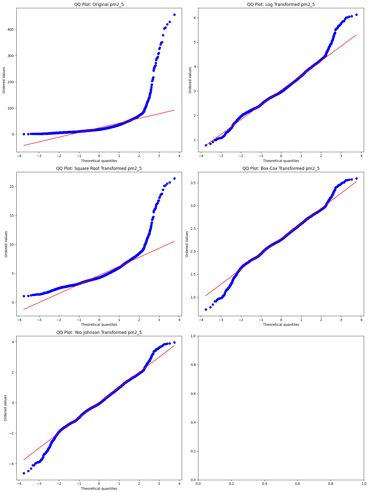
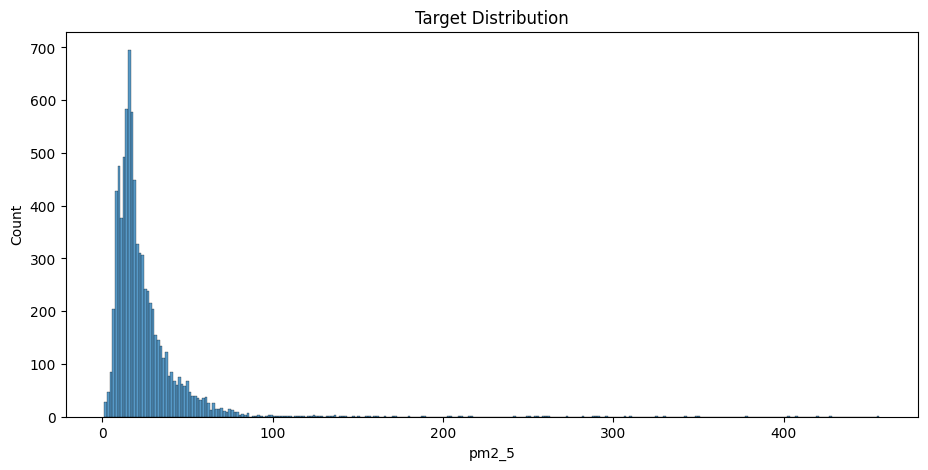
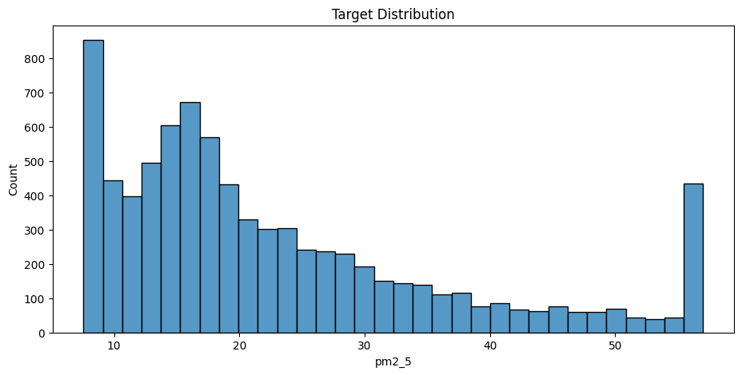

# AirQo-African-Air-Quality (2023/2024 Data)
Estimation and validation of PM2.5 levels using satelitte and ground observations in selected african cities for env justice

Data Analysis: 
1- Skewness of the PM2.5 variable in the training data:
We can see that the PM2.5 has a right skew.
* Original pm2_5: Skewness = 7.383403684525106, Kurtosis = 86.1193415970843
* Log Transformed: Skewness = 0.49138261989345633, Kurtosis = 1.4359962407868387
* Square Root Transformed: Skewness = 2.529693698583593, Kurtosis = 14.19940623948297
* Box-Cox Transformed: Skewness = -0.03428424477994078, Kurtosis = 0.9151702451491679
* Yeo-Johnson Transformed: Skewness = -0.03428420696278356, Kurtosis = 0.9151702374814694

Visual Represnetation of skeweness :
For the following figure the more points are aligned with the straight line the better it is the approach for reducing skewness of PM2.5.

After studying the skewness I decided to not opt for any transformation. as it shifted the PM2.5 variation interval. However I worked around handling outliers using the winsorize module.

The histogram of the PM2.5 before handling outliers

The histogram of the PM2.5 after handling outliers. A percentage of 3% was selected after an emperical analysis.

